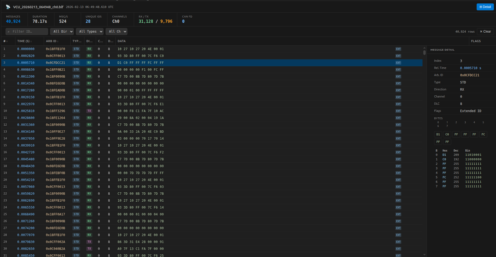

# BLF Viewer

View and analyze **Binary Logging Format (BLF)** CAN bus log files directly in VS Code — no external tools required.

BLF is the native recording format of Vector CANalyzer, CANoe, and related automotive diagnostic tools. This extension lets you inspect `.blf` files as a structured, filterable table without leaving your editor.

---

## Sample Screenshot

Below is a sample viewer screenshot. The left panel shows the message table with filters applied, and the right panel shows the details for a selected CAN frame.



## Features

### Automatic file association

Opening any `.blf` file in VS Code launches the viewer automatically. No commands needed.

### Virtual scrolling — handles large files

Files with hundreds of thousands of messages open instantly. The viewer renders only the rows currently visible on screen, keeping memory usage constant regardless of file size.

### Stats dashboard

At a glance: total message count, recording duration, messages/sec throughput, unique arbitration IDs, active channels, RX/TX split, and CAN FD frame count.

### Filter toolbar

Narrow down messages by:

- **Arbitration ID** — hex substring match (e.g. `7e0` matches `0x07E0`, `0x17E0`, etc.)
- **Direction** — RX, TX, or both
- **Type** — Standard CAN, CAN FD, or Error frames
- **Channel** — individual channel or all

### Sortable columns

Click any column header to sort ascending; click again to reverse. Sorting is applied on the full filtered dataset on the extension host before paging, so the order is always correct across all pages.

### Resizable and reorderable columns

Drag a column edge to resize it. Drag a column header to a new position to reorder. Use the **⊞ Columns** button to show or hide individual columns.

### Multi-select

- **Click** — single select
- **Ctrl / Cmd + Click** — toggle individual rows
- **Shift + Click** — select a contiguous range

The selection count is shown in the toolbar.

### Right-click context menu

Right-click any row for quick actions:

| Action                  | Description                                                     |
| ----------------------- | --------------------------------------------------------------- |
| Add to Filter           | Sets the ID filter to this message's arbitration ID             |
| Show Details            | Opens the detail panel for this row                             |
| Colorize                | Highlights the row (or selection) in a chosen color             |
| Group by…               | Groups rows visually by type, direction, channel, or ID         |
| Select all with same ID | Multi-selects every visible row sharing the same arbitration ID |
| Copy row                | Copies tab-separated values to the clipboard                    |
| Copy Arb ID             | Copies the hex arbitration ID                                   |
| Copy data bytes         | Copies the hex byte string                                      |
| Copy selection as CSV   | Exports all selected rows as CSV with a header row              |
| Remove color            | Clears colorization from the row or selection                   |

### Detail panel

Select any row to see the full message breakdown: byte grid, hex/decimal/binary table for each byte, and all decoded flags (Extended ID, Remote Frame, BRS, ESI).

### Supported frame types

- CAN 2.0A — 11-bit standard frames
- CAN 2.0B — 29-bit extended frames
- CAN FD — with Bit Rate Switch (BRS) and Error State Indicator (ESI)
- Error frames

### Theme adaptive

Uses VS Code CSS variables throughout — works correctly with any light or dark color theme.

---

## Requirements

- VS Code **1.109.0** or later
- No external dependencies or native modules — pure TypeScript

---

## Usage

1. Open a `.blf` file via **File → Open File** or by double-clicking in the Explorer panel
2. The BLF Viewer opens automatically as a custom editor
3. Use the filter toolbar to search for specific messages
4. Click any row to inspect its bytes in the detail panel on the right
5. Click **⊟ Detail** in the top bar to show or hide the detail panel
6. Right-click any row for copy, colorize, filter, and grouping options

You can also open a file explicitly from the Command Palette:

```
BLF: Open File
```

---

## Extension Settings

This extension does not contribute any configurable settings.

---

## Release Notes

### 0.2.0

Resizable and reorderable columns, column visibility toggle, real host-side sorting, multi-select, right-click context menu with colorize / group / copy actions, and fixes for sort key mismatch, empty-filter ghost rows, and leading-zero ID matching.

### 0.1.0

Initial release. Virtual scrolling viewer with filtering, stats dashboard, detail panel, and full CAN / CAN FD / error frame support.

---

## About BLF

The Binary Logging Format (`.blf`) is a binary container format developed by Vector Informatik GmbH. It stores timestamped CAN, CAN FD, LIN, FlexRay, and other bus messages in compressed blocks (LOBJ containers). This extension implements the CAN and CAN FD portions of the format.

---

## License

MIT
