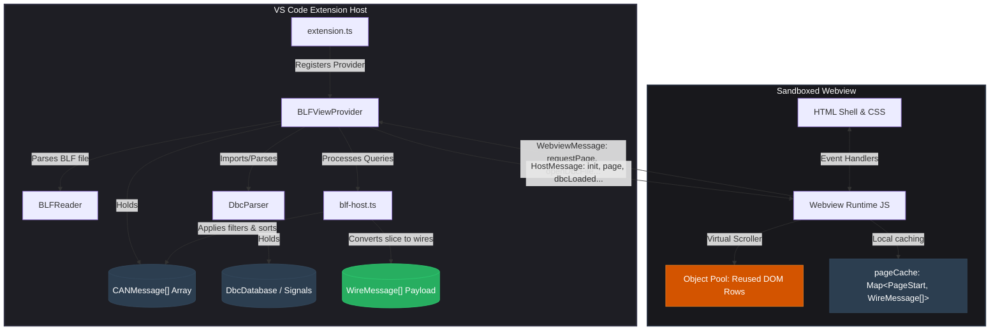
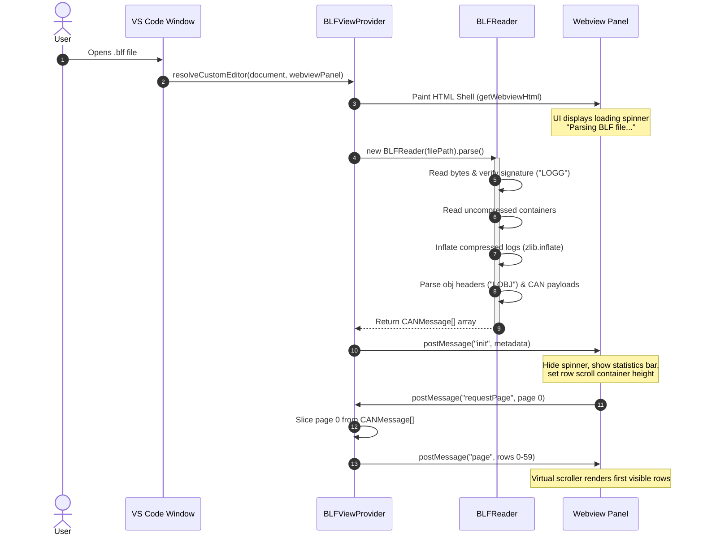
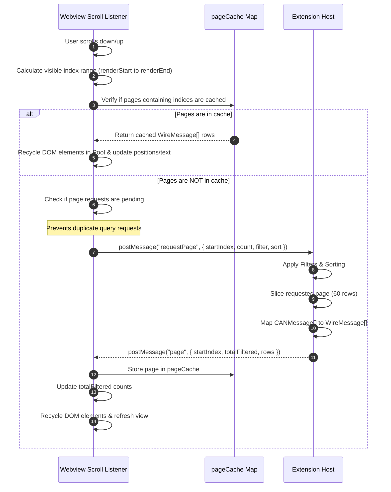
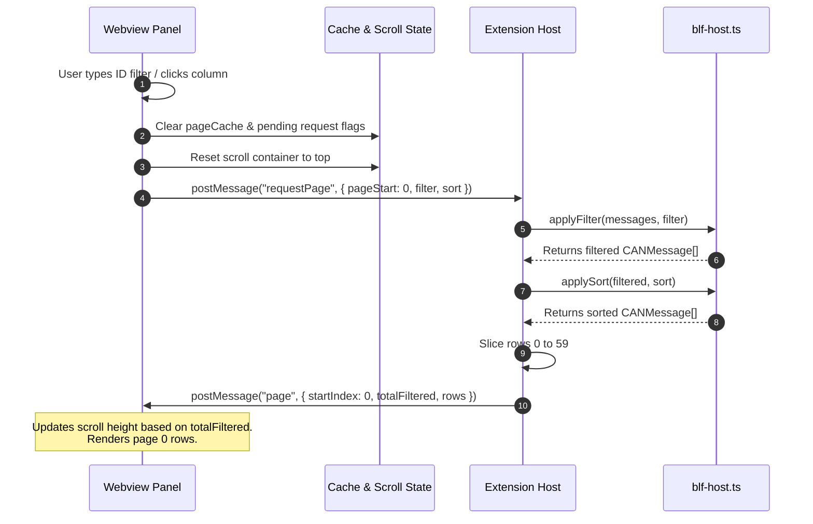
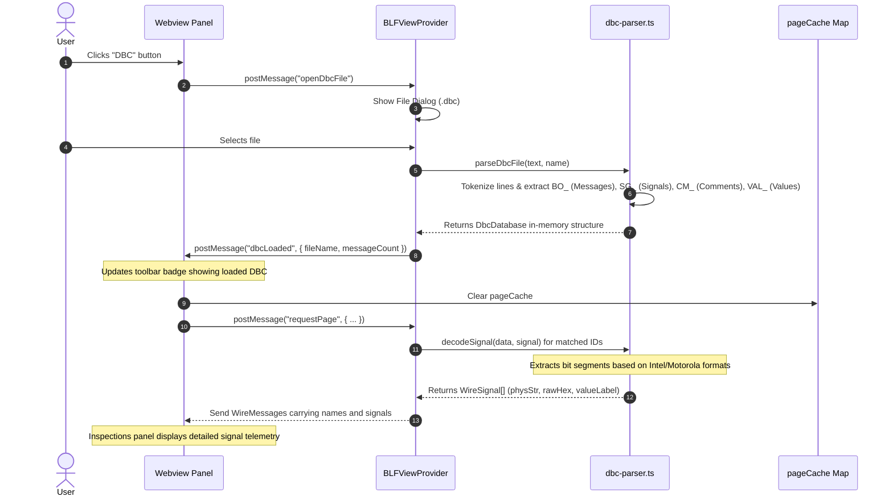

# Vector BLF Viewer – Design and Architecture Documentation

This document describes the design, architecture, data flows, and parsing internals of the VS Code **BLF Viewer** extension.

---

## 1. High-Level Architecture Overview

The BLF Viewer extension enables high-performance inspection of Vector Binary Logging Format (`.blf`) files in VS Code. It uses a **custom readonly editor provider** architecture to separate heavy file parsing and query execution (in the Node.js Extension Host) from visual rendering (in a sandboxed Webview).



### Module Responsibilities

| File | Subsystem | Responsibility |
| :--- | :--- | :--- |
| [`extension.ts`](file:///home/marifat/personal/vscode-blf-reader/blf-viewer/src/extension.ts) | Core / Entry | Registers the custom editor provider (`blf.viewer`) and the `blf.openFile` command. |
| [`blfViewProvider.ts`](file:///home/marifat/personal/vscode-blf-reader/blf-viewer/src/blfViewProvider.ts) | Controller / Broker | Implements `vscode.CustomReadonlyEditorProvider`. Coordinates life-cycle events, maintains parsed state in-memory, parses/applies DBC templates, and acts as the communications bridge between host and webview. |
| [`blf-parser.ts`](file:///home/marifat/personal/vscode-blf-reader/blf-viewer/src/blf-parser.ts) | Parsing / Parser | Implements `BLFReader`, which parses binary structure, extracts headers, handles zlib decompression, and maps log packages to internal `CANMessage` structs. |
| [`blf-host.ts`](file:///home/marifat/personal/vscode-blf-reader/blf-viewer/src/blf-host.ts) | Backend Query Engine | Pure functions for sorting, filtering, matching, and converting `CANMessage` slices to lightweight `WireMessage` rows. |
| [`dbc-parser.ts`](file:///home/marifat/personal/vscode-blf-reader/blf-viewer/src/dbc-parser.ts) | Database Engine | Parses Vector CAN database (`.dbc`) files and decodes raw CAN payloads using signal attributes (Intel/Motorola byte orders, bit masks, scale/offset). |
| [`blf-types.ts`](file:///home/marifat/personal/vscode-blf-reader/blf-viewer/src/blf-types.ts) | Interfaces / Types | Defines strict type definitions for the Webview↔Host protocol (`WebviewMessage`, `HostMessage`, `WireMessage`, `WireSignal`). |
| [`blf-webview.ts`](file:///home/marifat/personal/vscode-blf-reader/blf-viewer/src/blf-webview.ts) | Frontend UI | Houses the template string for HTML/CSS and the fully client-side JavaScript runtime (Virtual Scroller, Page Cache, details viewer, column configuration). |

---

## 2. Sequence Flows

### 2.1 File Initialization Flow

When a user opens a `.blf` file, the extension paints the interface structure immediately (minimizing startup latency) and initiates background parsing.



### 2.2 Virtual Scroller & Paging Flow

Rather than parsing thousands of DOM elements (which would crash or freeze the Chromium renderer), the webview requests 60-row chunks as the user scrolls, recycling an object pool of approximately 30-40 elements.



### 2.3 Filtering and Sorting Execution Flow

When a user alters filter inputs (e.g. typing arbitration IDs) or clicks column headers to sort, the webview invalidates its cache and requests a refreshed dataset.



### 2.4 DBC Database Parsing and Decoding Flow

A DBC file acts as a database mapping raw CAN arbitration IDs to signal descriptions.



---

## 3. Parsing Details (`blf-parser.ts`)

Vector's Binary Logging Format utilizes a chunk-based log system. It starts with a standard header, followed by multiple log objects (some of which are zlib-compressed blocks containing nested child objects).

### 3.1 Binary Signatures & Layouts

```
BLF File Layout:
+--------------------------------------------------------------+
| File Header ("LOGG") - 144 bytes                             |
+--------------------------------------------------------------+
| Object Header Base ("LOBJ") - 16 bytes                       |
+--------------------------------------------------------------+
| Object Header V1 / V2 Extension - 12 or 16 bytes             |
+--------------------------------------------------------------+
| Object Payload (e.g. compressed container, CAN message, etc.)|
+--------------------------------------------------------------+
| Object Header Base ("LOBJ") - 16 bytes                       |
+--------------------------------------------------------------+
| ...                                                          |
+--------------------------------------------------------------+
```

#### A. File Header (`LOGG`) – 144 Bytes
*   **Signature** (4 bytes): ASCII `"LOGG"`
*   **Header Size** (4 bytes): LE uint32, usually `144`
*   **File Size** (8 bytes): LE uint64, total file size in bytes
*   **Uncompressed Size** (8 bytes): LE uint64, uncompressed contents size
*   **Object Count** (4 bytes): LE uint32, number of objects in the file
*   **Start Timestamp** (16 bytes): Windows `SYSTEMTIME` (UTC) format: `[year, month, dayOfWeek, day, hour, minute, second, milliseconds]`
*   **Stop Timestamp** (16 bytes): Windows `SYSTEMTIME` (UTC) format

#### B. Object Header Base (`LOBJ`) – 16 Bytes
*   **Signature** (4 bytes): ASCII `"LOBJ"`
*   **Header Size** (2 bytes): LE uint16, offset to the object payload
*   **Header Version** (2 bytes): LE uint16
*   **Object Size** (4 bytes): LE uint32, size of header + payload (aligned to 4-byte boundaries)
*   **Object Type** (4 bytes): LE uint32

#### C. Object Header Extension (V1/V2) – 12 or 16 Bytes
*   **Flags** (4 bytes): LE uint32. Determines timestamp resolution:
    *   If bit 0 (`TIMESTAMP_FLAG_TEN_MICS` = 0x1) is set: resolution is **10 microseconds** (multiply by `10e-6`).
    *   Otherwise: resolution is **nanoseconds** (multiply by `1e-9`).
*   **Client Index** (2 bytes): LE uint16
*   **Object Version** (2 bytes): LE uint16
*   **Timestamp** (8 bytes): LE uint64. Relative timestamp offset.
*   **Original Timestamp** (8 bytes, V2 only): LE uint64.

### 3.2 Main Object Types Processed

1.  **`LOG_CONTAINER` (Type 10)**:
    *   Acts as a compressed packaging wrap.
    *   Contains a `compressionMethod` (uint16 LE): `0` = raw (no compression), `2` = zlib deflate compression.
    *   Once inflated, contains a nested sequence of `LOBJ` structures (which the parser loops through recursively using `parseObjects`).
2.  **`CAN_MESSAGE` (Type 1) & `CAN_MESSAGE2` (Type 86)**:
    *   `channel` (2 bytes): uint16 LE, converted to 0-based channel representation.
    *   `msgFlags` (1 byte): direction (bit 0 set = TX, unset = RX) and remote frame status (bit 4 set = RTR).
    *   `dlc` (1 byte): Data Length Code.
    *   `arbitrationId` (4 bytes): uint32 LE. Masked with `0x1FFFFFFF`. If bit 31 (`0x80000000`) is set, it indicates an **Extended 29-bit CAN ID**; otherwise, a **Standard 11-bit CAN ID**.
    *   `data` (8 bytes): payload bytes.
3.  **`CAN_FD_MESSAGE` (Type 100)**:
    *   Supports high-bandwidth CAN FD logs.
    *   Includes additional flags like `ESI` (Error State Indicator) and `BRS` (Bitrate Switch).
    *   Payload capacity extends up to 64 bytes.
4.  **`CAN_FD_MESSAGE_64` (Type 101)**:
    *   Modern high-density CAN FD container layout. Holds values such as sample rates, frame lengths, and inline data payload.
5.  **`CAN_ERROR_EXT` (Type 73)**:
    *   Specifies CAN bus error frames, carrying diagnostic statistics like Error Conformance Conditions (ECC) and current channel errors.

---

## 4. DBC Signal Decoding Engine (`dbc-parser.ts`)

The DBC engine decodes raw buffer arrays into physical quantities (like temperature, speed, or voltage) based on signal definitions.

```
Example DBC Signal Rule:
SG_ Engine_Speed : 24|16@1+ (0.125,0) [0|8000] "rpm" Vector__XXX

Bit layout translation details:
- startBit: 24
- bitLength: 16
- byteOrder: Intel (@1)
- signed: Unsigned (+)
- factor: 0.125
- offset: 0
- unit: "rpm"
```

### 4.1 Intel vs. Motorola Bit Processing

The parsing engine handles endian differences using direct bitwise shifts:

#### Intel Bit Encoding (`intel`, `@1`)
Intel signals are little-endian. The `startBit` indicates the **Least Significant Bit (LSB)**.
*   **Bit Sequence**: Traversed from index `0` to `length - 1`.
*   **Bit Position**: Calculated as `bitPos = startBit + i`.
*   **Byte Offset**: `byteIdx = bitPos >> 3`.
*   **Bit Offset inside Byte**: `bitIdx = bitPos & 7`.
*   **Reconstruction**: `raw |= (data[byteIdx] >> bitIdx) & 1 << i`.

```
Intel bit ordering (startBit = LSB):
Byte 0: [7][6][5][4][3][2][1][0]  <-- Bit 0 is startBit
Byte 1: [15][14][13][12][11][10][9][8]
```

#### Motorola Bit Encoding (`motorola`, `@0`)
Motorola signals are big-endian. The `startBit` indicates the **Most Significant Bit (MSB)** in DBC bit indexing.
*   **Bit Sequence**: Traversed MSB-first.
*   **Byte Crossings**: Within a byte, the bit position decrements. When reaching the boundary (`cur & 7 === 0`), the pointer jumps to the MSB of the next byte (`cur + 15`).
*   **Reconstruction**: Bits are positioned starting from the MSB: `raw |= (data[byteIdx] >> bitInByte) & 1 << (length - 1 - i)`.

```
Motorola bit ordering (startBit = MSB):
Byte 0: [7][6][5][4][3][2][1][0]  <-- Bit 7 is startBit, decending to 0
Byte 1: [15][14][13][12][11][10][9][8] <-- Jump here next (bit 15 is MSB)
```

### 4.2 Value and Enum Resolution

*   **Signed Conversion**: If the signal is signed (`-`) and the MSB of the reconstructed raw value is set, the engine applies a two's complement adjustment: `raw -= (1 << bitLength)`.
*   **Physical Calculation**: Matches the standard linear scale: `physical = raw * factor + offset`.
*   **State Enums (`VAL_`)**: If the DBC lists enumeration labels (e.g. `0` = `"Idle"`, `1` = `"Drive"`), they are looked up in the loaded metadata map and displayed next to the physical value.

---

## 5. Webview & UI Performance Systems (`blf-webview.ts`)

The Webview runs as a single-page app inside a sandboxed iframe.

### 5.1 CSS Theme Variable Bindings
To blend seamlessly with VS Code, all colors are defined dynamically using native CSS custom properties mapped to VS Code's editor tokens:
*   `var(--bg)`: maps to `var(--vscode-editor-background)`
*   `var(--fg)`: maps to `var(--vscode-editor-foreground)`
*   `var(--accent)`: maps to `var(--vscode-button-background)`
*   `var(--border)`: maps to `var(--vscode-panel-border)`
*   `var(--green)`: maps to `var(--vscode-testing-iconPassed)`
*   `var(--red)`: maps to `var(--vscode-errorForeground)`

### 5.2 Virtual Scroll Implementation details
To keep layout rendering smooth, the scroller performs the following steps:
1.  **Height Spacer**: A container (`.spacer`) is set to `totalFiltered * ROW_H` to simulate scroll heights correctly.
2.  **Overscan Buffer**: Rows are rendered from `firstVisible - OVERSCAN` to `lastVisible + OVERSCAN`.
3.  **Element Recycling**: A set of `row` divs are cached in `rowPool`. On scrolling, their properties (`style.top`, text content, classes) are modified in-place instead of recreating nodes.
4.  **Flexible Column Sizing**: Calculated dynamically based on user drag interactions. Settings are saved to `localStorage` (e.g., `blf.filterIdWidth`).
